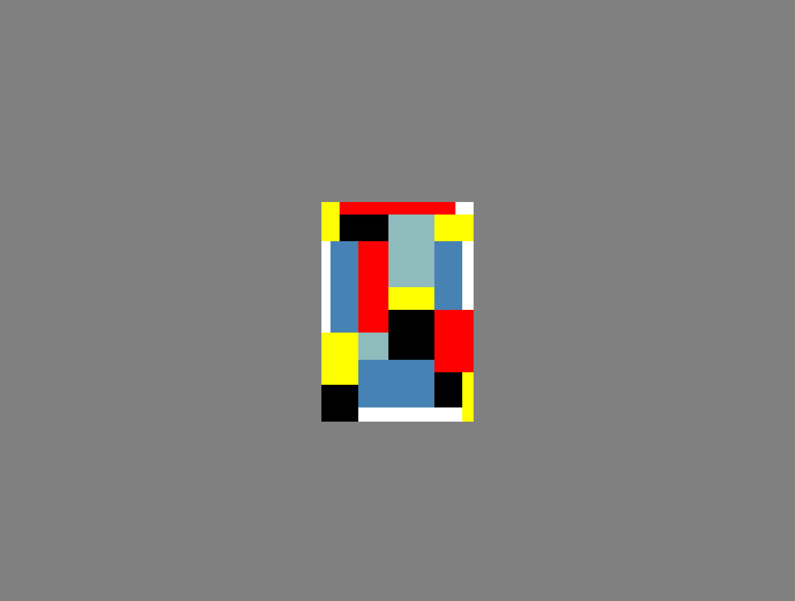
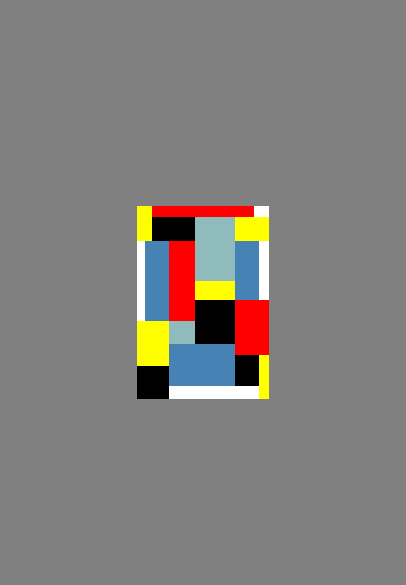
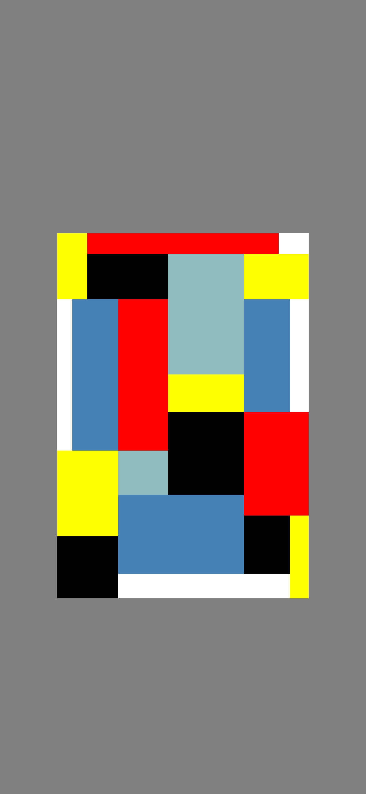

# Grid Composition Painting Project

## [Live Demo](https://pbain63.github.io/grid_composition-painting_project/)

---

## Overview

This project is a creative CSS grid-based composition inspired by modern art and abstract painting techniques. The layout is constructed entirely with HTML5 and CSS3, no images or JavaScript—focusing purely on design through code.

It’s an artistic experiment and an educational showcase for:

- CSS Grid layout capabilities
- Color theory in UI
- Minimalist visual design through code

---

## Project Highlights

- Inspired by **Mondrian-style** abstract painting
- Built with semantic HTML and advanced CSS Grid layout
- Responsive design that adapts to screen size
- Clean and scalable CSS structure for experimentation

---

## Technologies Used

- **HTML5** — semantic structure
- **CSS3** — CSS Grid, FlexBox, custom colors, border spacing
- **Git & GitHub** — version control and deployment via GitHub Pages

---

## Preview

| Desktop View                                                                      | Tablet View                                                                     | Mobile View                                                                     |
| --------------------------------------------------------------------------------- | ------------------------------------------------------------------------------- | ------------------------------------------------------------------------------- |
|  |  |  |

---

## Features

- Fully **responsive layout** using CSS Grid
- Abstract grid-based art with **dynamic color zones**
- Built without frameworks or libraries — **pure HTML & CSS**
- Minimal markup for maximum design impact

---

## Getting Started

### 1. Clone the Project

`git clone https://github.com/pbain63/grid_composition-painting_project.git`

### 2. Open in Browser

Open `index.html` directly in a browser, or use Live Server in VSCode for development.

### 3. Deploy with GitHub Pages

Already deployed! To deploy your own fork:

- Go to your GitHub repository
- Navigate to **Settings > Pages**
- Choose the `main` branch and root directory
- Save and wait for GitHub to publish your site

---

## Ideas for Extension

- Add hover interactions to individual grid blocks
- Animate grid cells using CSS transitions
- Randomize layout using JavaScript for generative art
- Convert design to React / Vue components

---

## Contributing

Want to experiment or extend the artwork?

1. Fork the project
2. Create a branch (`git checkout -b feature/MyDesign`)
3. Commit changes (`git commit -m 'Add color variation'`)
4. Push to your fork (`git push origin feature/MyDesign`)
5. Submit a Pull Request

---

## Art Reference:

<!-- https://www.museothyssen.org/en/collection/artists/doesburg-theo-van/composition-xx -->

Artwork: _Composition XX (1920)_

Artist: [Theo van Doesburg (1883–1931)](https://en.wikipedia.org/wiki/Theo_van_Doesburg)

Source: [Museo Nacional Thyssen-Bornemisza, Madrid](https://www.museothyssen.org/en/collection/artists/doesburg-theo-van/composition-xx)

License: Public Domain

---

## License

This project is open source and available under the [MIT License](LICENSE).

---

Created with ❤️ by [Prodip Bain](https://github.com/pbain63)

---
